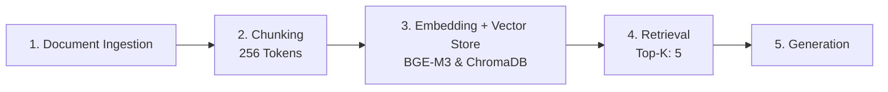

# Project 1 Planning: The Unofficial Guide

> Write this document before you write any pipeline code.
> Your spec and architecture diagram are what you'll use to direct AI tools (Claude, Copilot, etc.) to generate your implementation — the more specific they are, the more useful the generated code will be.
> Update the Retrieval Approach and Chunking Strategy sections if you change your approach during implementation.
> Update this file before starting any stretch features.

---

## Domain

The domain that I choose was student reviews of CS professors at the University of Nevada-Reno for incoming Freshman. This knowledge is valuable since many professors and course subject material are available in the course catalog, but these reviews are directly from student experiences. It gives insight from peer to peer which seems more trustworthy than seeing what the course offers.

---

## Documents

<!-- List your specific sources: URLs, subreddit names, forum threads, or file descriptions.
     Aim for at least 10 sources that together cover different subtopics or perspectives within your domain. -->

| # | Source | Description | URL or location |
|---|--------|-------------|-----------------|
| 1 | Erin Keith – Rate My Professors Profile | Deep repository tracking grading stringency, lab structures, and test styles for introductory sequences. | https://www.ratemyprofessors.com/professor/2264014 |
| 2 | Sara Davis – Rate My Professors Profile | Compiles alternative perspectives on intro-level programming, tracking her pacing, slide clarity, and responsiveness. | https://www.ratemyprofessors.com/professor/2575540 |
| 3 | r/unr Thread: "CS 135 - Professor Davis or Keith?" | A direct head-to-head comparison evaluating lecturing style versus project guidance for the two main freshman options. | https://www.reddit.com/r/unr/comments/dvh9mx/cs_135_professor_davis_or_keith/ |
| 4 | r/unr Thread: "CS135 Erin Keith Vs Siming" | Student analysis detailing historical syllabus rigidity, project weights, and advice on navigating exams. | https://www.reddit.com/r/unr/comments/8wdzw7/cs135_erin_keith_vs_siming/ |
| 5 | Christos Papachristos – RMP Faculty Profile | Collects student feedback for the immediate sophomore step (CS 202). Reviews explicitly breakdown his rigorous testing expectations and the adjustment to object-oriented logic. | https://www.ratemyprofessors.com/professor/2245066 |
| 6 | r/unr Thread: "How is the CS department here?" | Student advice summarizing the importance of leveraging Teaching Assistants (TAs) and joining peer Discord servers early. | https://www.reddit.com/r/unr/comments/e44kg7/how_is_the_cs_department_here/ |
| 7 | r/unr Thread: "How is the computer science/engineering program at Unr?" | Compiles student feedback in Intro to Programming | https://www.reddit.com/r/unr/comments/1h1pybh/how_is_the_computer_scienceengineering_program_at/ |
| 8 | r/unr Thread: "CS 135" | Contains crucial peer warnings about navigating the introductory course. Highlights the danger of falling behind on weekly projects and why relying on AI code tools prevents you from passing handwritten tests. | https://www.reddit.com/r/unr/comments/h9v9cz/cs_135/ |
| 9 | r/unr Thread: "CS202 Sara Davis Rant" | An unfiltered look at the extreme pacing of taking core programming classes during the accelerated summer term. Peer reviews break down the structural difficulties of intermediate C++ concepts like templating and inheritance under strict deadlines. | https://www.reddit.com/r/unr/comments/1e482bt/cs202_sara_davis_rant/ |
| 10 | Bashira Akter – RMP Faculty Profile | Tracks student reviews for introductory/early elective environments. Commentary details her helpfulness, approachable lecturing style, and how she introduces freshmen to foundational AI/Machine Learning concepts without overwhelming them. | https://www.ratemyprofessors.com/professor/2825729 |

---

## Chunking Strategy

**Chunk size:**
256 tokens

**Overlap:**
64 tokens

**Reasoning:**
Since the sources are mostly short reviews, the chunk size will be in 256 tokens to prevent context fragmentation and dilution.
Overlap is 64 tokens because most sources are short reviews. This also offsets very long reviews.

---

## Retrieval Approach

**Embedding model:** bge-m3

**Top-k:** 5

**Production tradeoff reflection:**
If deploying this for real users and cost wasn't a constraint, tradeoffs in choosing a different embedding model would be between latency for faster response retrieval and accuracy to make sure the answer is grounded. That would mean changing to a more precise embedding model that has expanded context length, which costs more but has higher retrieval. For multilingual support, it would be beneficial to have reviews from different platforms in a different native language. The tradeoff is whether there is high computation overhead. Some users may only want English. This support can offset accuracy, while others want to allocate the model capacity to multilingual use.

bge-m3 was chosen since it is versatile for RAG. It supports hybrid retrieval (semantics and keyword matching)

---

## Evaluation Plan

<!-- List your 5 test questions with their expected correct answers.
     Questions should be specific enough that you can judge whether the system's response
     is right or wrong. "What are good dining halls?" is too vague.
     "What do students say about wait times at [dining hall name] during lunch?" is testable. -->

| # | Question | Expected answer |
|---|----------|-----------------|
| 1 | Who teaches CS 135 at UNR?| Erin Keith |
| 2 | Is attendance mandatory for CS219 in Bashira Akter's course ?| No |
| 3 | What is the overall quality of Erin Keith on Rate My Professor? | 2.8/5 |
| 4 | What is the level of difficulty in a course with Sara Davis on Rate my Professor? | 4 |
| 5 | What is percent of students who would take Papachristos again in Rate My Professor? | 39% |

---

## Anticipated Challenges

<!-- What could go wrong? Name at least two specific risks with reasoning.
     Consider: noisy or inconsistent documents, missing source attribution, off-topic
     retrieval, chunks that split key information across boundaries. -->

1. It can be hard to get an expected answer since these are people's personal opinions. Hard to reference a ground truth since reviews are dependent on each student's experience.

2. Some of the data can be out of date. Constantly there is a new rotation of professors, with some leaving and some entering the department. Some of the information may not be relevant anymore.

---

## Architecture

---

## AI Tool Plan

<!-- For each part of the pipeline below, describe:
     - Which AI tool you plan to use (Claude, Copilot, ChatGPT, etc.)
     - What you'll give it as input (which sections of this planning.md, which requirements)
     - What you expect it to produce
     - How you'll verify the output matches your spec

     "I'll use AI to help me code" is not a plan.
     "I'll give Claude my Chunking Strategy section and ask it to implement chunk_text()
     with my specified chunk size and overlap" is a plan. -->

**Milestone 3 — Ingestion and chunking:**
I will use Claude 3.5 Sonnet to write pipeline logic. Inputs to the prompt will be the chunk strategy including token overlap, mermaid diagram architecture, and a text example from Rate My Professor and the subreddis. The expected output is a Python script that can process the text files into cleanly isolated text blocks with the professor name, attributed course, and reviews. The output will be verified by cross referencing with the sources.

**Milestone 4 — Embedding and retrieval:**
I will use Claude for the AI tool plan to write the embedding and retrieval. The inputs to the prompt will include the library, model, database, and top-k. The expected output will create a vector array from the bge-m3 library and return text strings. I can verify by choosing a professor review and querying for a keyword, seeing if the system returns the exact 5 matches.

**Milestone 5 — Generation and interface:**
I will use Claude for the web UI. I will use the vector store manager generated from the query in milestone 4 and a markdown of the structure guideline. The output will be a simple CLI where users can interact with the vector database. I will execute three test queries and see if the chunks are successfully retrieved. Then I will cross-reference with the source files to ensure there aren't any hallucinations.